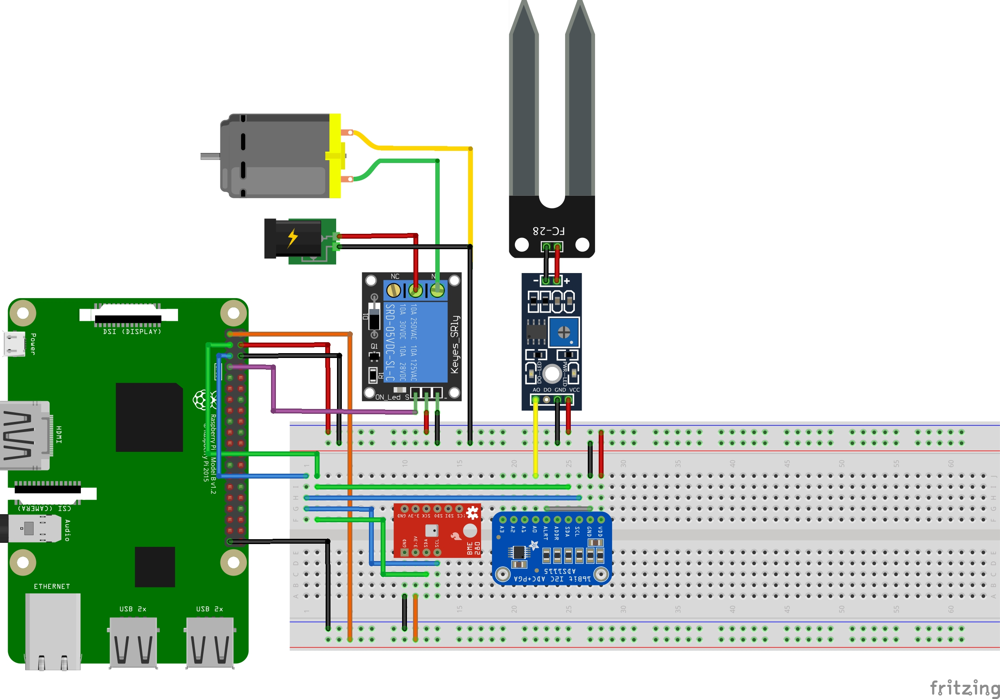

# smartwatering-androidthings
Android Things application for SmartWatering project

## Pre-requisites

- Android Things compatible board. I use Raspberry Pi 3
- Android Studio 2.2+
- BME280 Sensor (temperature, pressure, humidity)
- Soil Moisture Sensor
- Analog-to-digital Converter (ADS1115)
- DC water pump
- 5V Relay

## Build and install

Open the project with Android Studio and click "Run"

If you prefer to run on the command line, type

```bash
./gradlew installDebug
adb shell am start com.things.smartwatering/.MainActivity
```

## Schematics



## License

Copyright 2018 The Android Open Source Project, Inc.

Licensed to the Apache Software Foundation (ASF) under one or more contributor
license agreements.  See the NOTICE file distributed with this work for
additional information regarding copyright ownership.  The ASF licenses this
file to you under the Apache License, Version 2.0 (the "License"); you may not
use this file except in compliance with the License.  You may obtain a copy of
the License at

  http://www.apache.org/licenses/LICENSE-2.0

Unless required by applicable law or agreed to in writing, software
distributed under the License is distributed on an "AS IS" BASIS, WITHOUT
WARRANTIES OR CONDITIONS OF ANY KIND, either express or implied.  See the
License for the specific language governing permissions and limitations under
the License.
